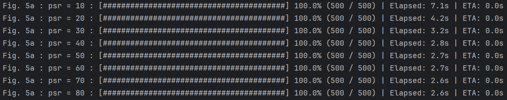

# p-DAG Execution Timing Simulator

<p align="center">
<a href="https://www.rtss.org"></a>&nbsp;<a href="https://github.com/RTS-SYSU" rel="nofollow"></a>&nbsp;<a href="#"></a>&nbsp;<a href="#"></a>&nbsp;<a href="LICENSE"></a></p>


This repository provides the implementation and experimental code accompanying the paper: "Response Time Analysis for Probabilistic DAG Tasks in Multicore Real-Time Systems" submitted in RTSS 2025.


## 🐳 Installing Docker (on Linux)

### System Requirements

- 64-bit Linux with kernel 3.10+
- Root access or a user with `sudo` privileges

### Method 1: Install via Official Repository (Ubuntu/Debian)

```sh
sudo apt update
sudo apt install -y apt-transport-https ca-certificates curl gnupg lsb-release

curl -fsSL https://download.docker.com/linux/ubuntu/gpg | sudo gpg --dearmor -o /usr/share/keyrings/docker-archive-keyring.gpg

echo "deb [arch=amd64 signed-by=/usr/share/keyrings/docker-archive-keyring.gpg] https://download.docker.com/linux/ubuntu $(lsb_release -cs) stable" | sudo tee /etc/apt/sources.list.d/docker.list > /dev/null

sudo apt install -y docker-ce docker-ce-cli containerd.io
```

### Method 2: Quick Install via Script (Recommended)

```sh
sudo curl -fsSL https://get.docker.com | sudo sh
```

### Start Docker Service

```sh
sudo systemctl start docker
```


## 🚀 Docker-Based Experiment Workflow

This project uses Docker to support modular, on-demand experiment execution. You can:

1. Build or pull a Docker image
2. Start a long-running container that waits for commands
3. Send specific experiment commands (e.g., `deviation`, `cost`, `design`)
4. Generate plots independently at any time
5. Stop and clean up the container

### Image Preparation

You can choose how to prepare the Docker image (just choose one of them):

> When building the Docker image locally, if the prompt indicates that pulling OpenJDK has failed, it may be necessary to connect to a VPN to access the corresponding repository.

```bash
sudo ./run.sh build      # Build image locally

# OR

sudo ./run.sh pull       # Pull from Docker Hub
```

### Start the Container

```bash
sudo ./run.sh run
```

This will start a background container running the Java entrypoint (Main class) and wait for commands.

### Run Experiments

Once the container is running, you can send commands like:

> Note that the results shown in Fig. 6 can be obtained in the experiments related to Fig. 5c. So if you have executed `sudo ./run.sh deviation cond`, you do not need to execute `sudo ./run.sh cost` again, unless you want to reproduce the results shown in Fig. 6 separately.

```bash
# Run all experiments
sudo ./run.sh all


# Run DeviationAnalysis to replicate the result shown in Fig. 5 in the paper
sudo ./run.sh deviation
# Replicate the result shown in Fig. 5a / 5b / 5c in the paper
sudo ./run.sh deviation psr
sudo ./run.sh deviation para
sudo ./run.sh deviation cond
# Replicate the results in specific subfigure in Fig. 5
sudo ./run.sh deviation psr 0.2 0.6
sudo ./run.sh deviation para 3 8
sudo ./run.sh deviation cond 2 6


# Run ComputationCostAnalysis to replicate the result shown in Fig. 6 in the paper
sudo ./run.sh cost
# Replicate the results under specific settings of the number of probabilistic structures
sudo ./run.sh cost 2 10


# Run DesignSolutionAnalysis to replicate the result shown in Table V in the paper
sudo ./run.sh design
# Replicate the results under specific settings of the number of probabilistic structures
sudo ./run.sh design 3 9
```

### Generate Figures

After running the experiments, you can generate all plots with:

```bash
sudo ./run.sh draw
```

All results will be copied to the `result/` folder on your host.

> ⚠️ *Note*: The figures may look different from those in the paper, because the publication figures were manually styled. However, the **data used is identical**. 
>
> When the corresponding data file does not exist, experimental result charts can also be drawn, and the corresponding data will not be displayed on the chart or table.

### Clean Up

To stop and remove the container and the built image:

```bash
sudo ./run.sh clean
```


## ⏳ Computational Time & Reproducibility Notes

This project has been tested on an Intel i5-13400F (2.5GHz) machine with 24GB RAM. 

Please note that the **enumeration-based analysis** can become **extremely time-consuming**, especially as the number of probabilistic structures increases. The runtime grows **exponentially** with the number of conditional branches. When the number exceeds 6 or 7, the enumeration method becomes **impractical**, often resulting in **heap memory overflow** errors.

To help with efficient experimentation, estimated runtimes for different configurations are provided below. You may adjust your reproduction scope based on your own computational resources. For convenience, we provide a flexible execution script (`run.sh`). For example:

```bash
sudo ./run.sh deviation cond 2 6
```

This command runs the experiment for probabilistic structure counts ranging from 2 to 6, skipping the very slow group with count = 7.


#### Estimated Experimental Time (Each group contains 500 randomly generated p-DAGs)

> During experiment reproduction, progress is clearly displayed in the form of a dynamic progress bar. The console output includes the following information:
>
> - Which experiment is currently being reproduced
> - The specific experimental settings (e.g., `psr=10`)
> - Reproduction progress, shown as a progress bar (e.g., out of 500 p-DAGs)
> - Elapsed time since the experiment started (Elapsed)
> - Estimated time remaining (ETA)

1. **Fig. 5a Runtime Overview**

   

   

2. **Fig. 5b Runtime Overview**

   

   

3. **Figs. 5c & 6 Runtime Overview**

   

   

4. **Table V Runtime Overview**

   


## 🛠 Script Logic Explained

Below is an explanation of the `run.sh` script, including how it builds the Docker image locally, runs the container, performs a full one-click experiment reproduction, or allows flexible selection of which experiment and parameter groups to reproduce.

### Step 1: Prepare the Docker image

Depending on the selected mode (`build`, `pull`, or default `auto`), the script determines how to prepare the Docker image:

```bash
if image_exists_locally; then
  echo "✅ The image exists locally."
else
  case "$MODE" in
    build)
      docker build -t $IMAGE_NAME .
      ;;
    pull)
      docker pull $IMAGE_NAME
      ;;
    auto)
      if docker pull $IMAGE_NAME; then
        echo "✅ Pull succeeded."
      else
        echo "⚠️ Pull failed. Building locally..."
        docker build -t $IMAGE_NAME .
      fi
      ;;
  esac
fi
```

### Step 2: Start the long-running container

```bash
docker run -dit --name $CONTAINER_NAME $IMAGE_NAME
```

This container will start the Java `Main` class and stay running, waiting for incoming commands via standard input.

### Step 3: Run specific experiments

The script sends experiment commands to the running container:

```bash
docker exec $CONTAINER_NAME java -cp "lib/*:bin" Main $*
```

These commands are passed to the Java main loop, which interprets and runs:

- `deviation [psr|para|cond] [start end]`
- `cost [start end]`
- `design [start end]`

Internally, it maps to:

- `DeviationAnalysis.runCond(...)`, etc.

### Step 4: Generate plots (optional)

You can generate plots separately at any time (even before all experiments finish):

```bash
docker exec $CONTAINER_NAME python3 scripts/deviation_analysis_plot.py
```

Or simply use:

```bash
sudo ./run.sh draw
```

Which will:

- Run all three Python plotting scripts
- Copy results back to host machine

### Step 5: Clean up

When finished:

```bash
docker rm -f $CONTAINER_NAME
```

This removes the container instance.


## 📦 Project Overview

This is a Java-based project designed to support the reproduction of multiple research papers focused on DAG (Directed Acyclic Graph) analysis. As a result, you may encounter some classes or components that contain attributes unrelated to the specific experiments presented in this paper. For example, the `DirectedAcyclicGraph` class includes a `CacheHierarchy` field, which pertains to cache-related experiments from other works. These can be safely ignored for the purpose of reproducing this paper's experiments.

The project is organized into the following major components:

1. **Experiment Parameter Modules**
    Located in the package `uk.ac.york.mocha.simulator.parameters`, this includes:
   - `StructuralParameters`: defines structural settings used in p-DAG construction
   - `SystemParameters`: includes critical system-level configurations such as hardware, number of cores, etc.
   - `SchedulingParameters`: covers parameters for scheduling policies
2. **p-DAG Generation Components**
    Found in `uk.ac.york.mocha.simulator.generator`, this module handles p-DAG creation:
   - `SystemGenerator`: generates the full DAG structure
   - `PathGenerator`: builds the conditional subgraphs within the DAG
   - etc.
3. **Entity Classes**
    Located in `uk.ac.york.mocha.simulator.entity`, this includes:
   - `Node`: represents a task or unit in the DAG
   - `DirectedAcyclicGraph`: the main DAG data structure
   - etc.
4. **Experiment Suite**
    All experiments related to the paper are located in `uk.ac.york.mocha.simulator.experiments_pDAG`. This includes:
   - `AllExprs`: contains all experiments, including those not included in the final publication
   - Other classes break out each individual experiment for clarity and ease of review


### How to Explore the Code

To understand how the experiments are performed, we recommend starting from the `DeviationAnalysis.Main` entry point. Using step-by-step debugging, you can observe how the DAGs are generated, analyzed, and which components are involved in the process.

Most helper functions can be treated as **black boxes**—you only need to focus on their input and output behavior to follow the overall logic. There's no need to dive into the internal implementation unless you're interested in the details.


### Key Experiment Classes

1. **`AllExprs`** – Contains all experiments, including those not shown in the paper. For clarity, the experiments published in the paper are separated into the following three classes.
2. **`DeviationAnalysis`** – Implements **Experiment 1**. Runs 500 trials under different `psr`, `parallelism`, and `number of conditional structures`. Tracks deviation and analysis time.
3. **`ComputationCostAnalysis`** – Implements **Experiment 2**. Measures analysis time difference between the proposed method and enumeration-based method under different conditional structure counts.
4. **`DesignSolutionAnalysis`** – Implements **Experiment 3**. Measures the minimum required number of cores for different acceptance thresholds across three approaches.


## 📬 Contact

Project Maintainers:

- **Zhiyang Lin** — [linzhy78@mail2.sysu.edu.cn]()
- **Shuai Zhao** — [zhaosh56@mail.sysu.edu.cn]()
- **Yiyang Gao** — [gaoyy26@mail2.sysu.edu.cn]()

